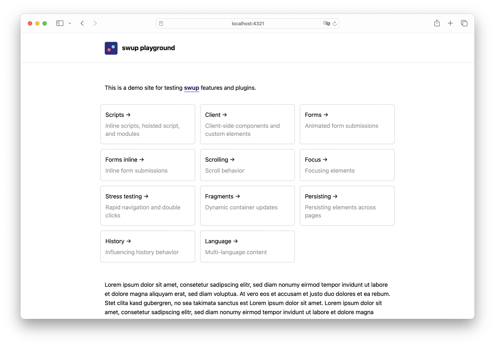

# Astro Swup Playground

Playground for testing and prototyping [swup](https://swup.js.org) features and plugins.



## Testing swup features and plugins

- Swup is initialised in `src/modules/router.ts`.
- Transition styles are defined in `src/styles/transitions.css`
- Feature checks are defined in `src/pages`

For simple tests, copy the `dist` module file of swup or any plugin into the `packages` folder and
import it instead of the official package. For more realistic tests, use
[npm link](https://docs.npmjs.com/cli/v8/commands/npm-link) or
[yalc](https://github.com/wclr/yalc/) and import as usual from the package.

```sh
cp ./preload-plugin/dist/index.module.js ./astro-swup-playground/src/packages/preload-plugin.js
```

```js
import SwupPreloadPlugin from '../packages/preload-plugin';
```

## Testing the @swup/astro integration

This project has the official swup integration installed, but disabled. To test the integration:

1. In `Layout.astro`, comment the router script `<script src="/src/modules/router"></script>`
2. In `astro.config.mjs`, uncomment the swup integration import and initilisation

## Commands

| Command                   | Action                                           |
| :------------------------ | :----------------------------------------------- |
| `npm install`             | Installs dependencies                            |
| `npm run dev`             | Starts local dev server at `localhost:3000`      |
| `npm run build`           | Build your production site to `./dist/`          |
| `npm run preview`         | Preview your build locally, before deploying     |
| `npm run astro ...`       | Run CLI commands like `astro add`, `astro check` |
| `npm run astro -- --help` | Get help using the Astro CLI                     |
